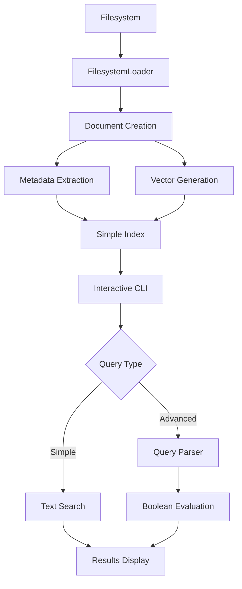
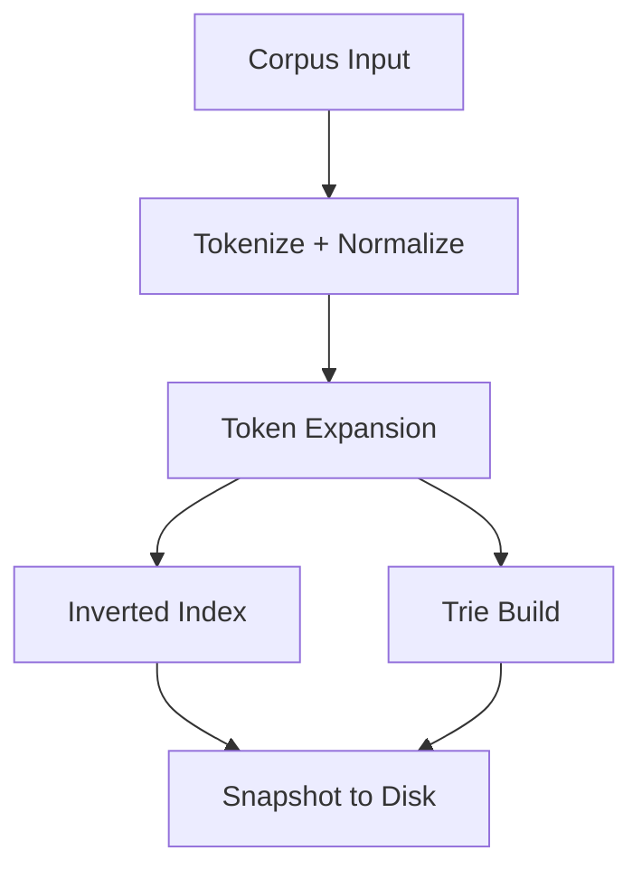
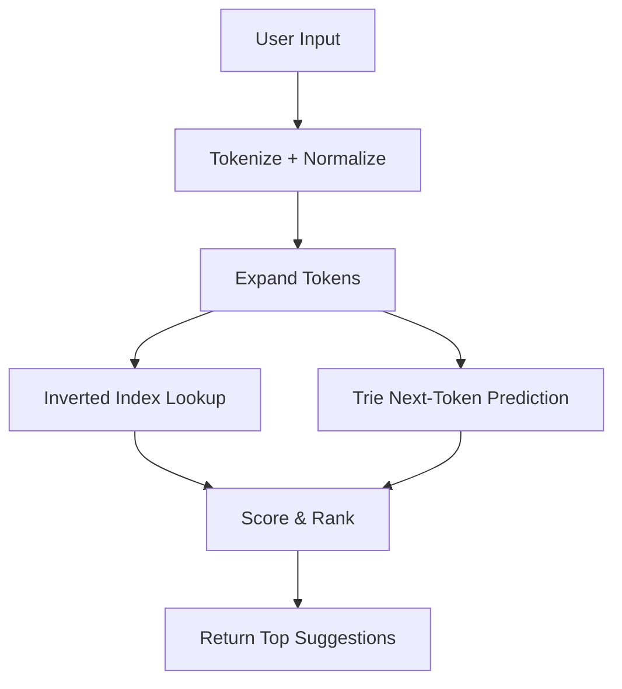

# Architecture — bit-scout

`bit-scout` is a modular search engine designed for fast typeahead, token-based matching, and prefix prediction. This document describes the high-level architecture for the **Alpha** release.

---

## 🧱 Core Components

### ✅ Implemented (Alpha)

#### 1. **Document Loading System**
* **Corpus Loader Interface**: Pluggable interface for loading documents from different sources
* **Loader Registry**: Manages multiple loader implementations
* **Filesystem Loader**: Loads documents from filesystem with rich metadata extraction
* **Document Model**: Rich document representation with ID, text, source, vector, and metadata

#### 2. **Basic Vectorization**
* Simple vector generation based on file characteristics:
  * File size (normalized)
  * Last modification time (normalized)
* Extensible for more sophisticated vectorization

#### 3. **Search Engine Core**
* **Simple Index**: In-memory document storage with fast lookup
* **Query Parser**: Advanced boolean query parsing with dimension filtering
* **Search Interface**: Both simple text search and advanced boolean queries
* **Index Statistics**: Document count and size tracking

#### 4. **CLI Interface**
* Interactive search interface with command-line prompts
* Document loading and display functionality
* Metadata and vector visualization
* Configuration display and help system

### 🚧 Planned Components (Alpha)

#### 5. **Corpus Parser**
* Reads raw queries or titles from loaded documents
* Tokenizes, lowercases, and normalizes them

#### 6. **Token Expander**
* Applies optional transformations:
  * Typo correction
  * Stemming
  * Transliteration
* Produces a set of variant tokens per input token

#### 7. **Advanced Inverted Index**
* Maps expanded tokens → candidate queries
* Stored in memory or embedded KV store (e.g., BoltDB)
* Optimized for fast token lookup

#### 8. **Trie Structure**
* Built from token sequences in the corpus
* Supports prefix-based next-token prediction
* Fast lookup during query time

#### 9. **Advanced Scoring Engine**
* Computes a score for each candidate based on:
  * Match type (exact, stemmed, typo)
  * Token frequency or custom weights (future)
  * Vector similarity (future)
* Returns top-k ranked suggestions

---

## 🔄 Current Search Flow

---

## 🔄 Planned Offline Indexing Flow

---

## 🔍 Planned Query-Time Flow (CLI / API)

---

## 🚰 Planned Extensions (Beta+)

* Redis-based hot cache for serving
* Multi-node sharding and cluster routing
* Embedding fallback and cosine similarity
* Personalization and logging hooks

---

## 📁 File Layout

### ✅ Implemented
| Path                           | Purpose                      |
| ------------------------------ | ---------------------------- |
| `internal/loaders/loader.go`   | Corpus loader interface      |
| `internal/loaders/registry.go` | Loader registry management   |
| `internal/loaders/filesystem.go` | Filesystem document loader  |
| `internal/models/document.go`  | Document model & metadata    |
| `internal/index/index.go`      | Index interface              |
| `internal/index/simple.go`     | Simple in-memory index       |
| `internal/index/query.go`      | Advanced query parser        |
| `cmd/bitscout/main.go`         | Interactive CLI app          |

### 🚧 Planned
| Path                           | Purpose                      |
| ------------------------------ | ---------------------------- |
| `internal/engine/trie.go`      | Trie structure & search      |
| `internal/engine/expansion.go` | Typo/stem/translit expansion |
| `scripts/build_index.go`       | Index builder (offline)      |

---

*This document will grow as the system evolves. Contributions welcome.*
