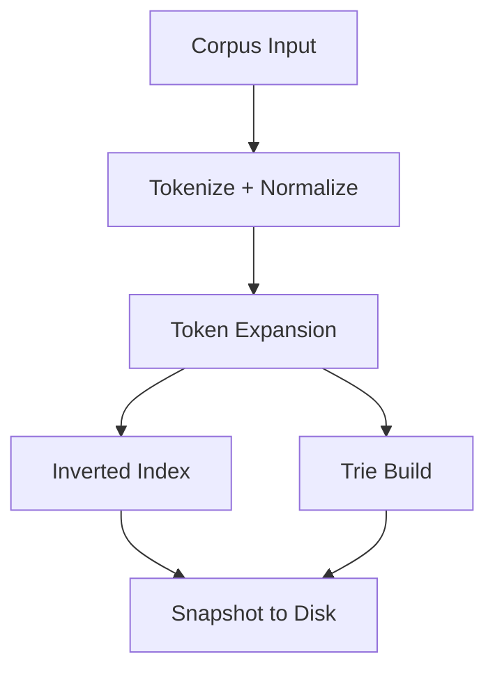
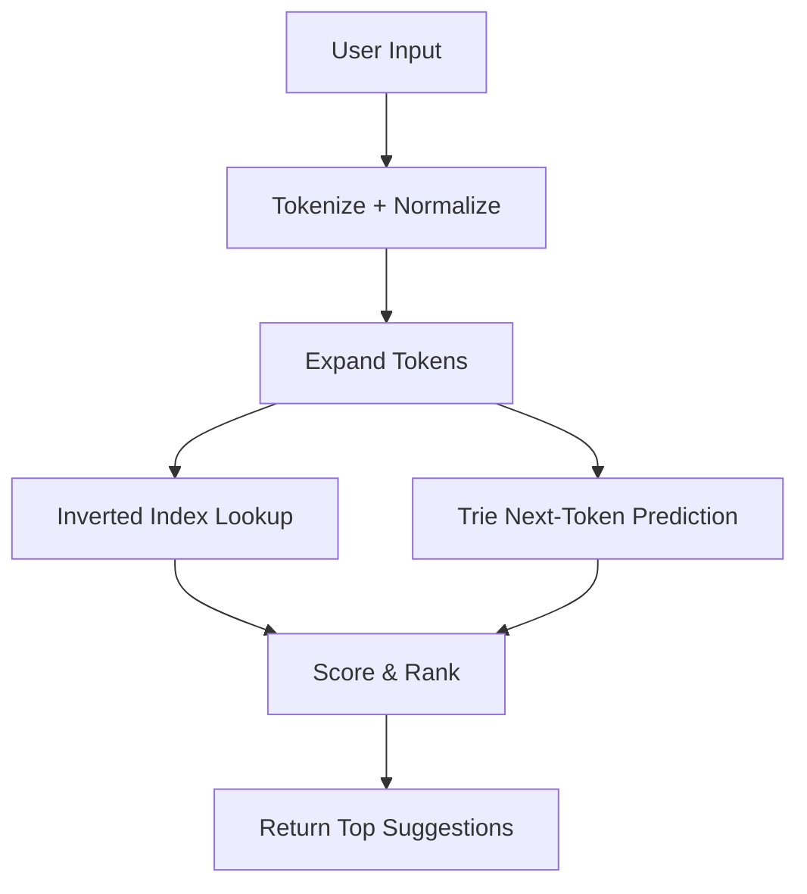

# Architecture — bit-scout

`bit-scout` is a modular search engine designed for fast typeahead, token-based matching, and prefix prediction. This document describes the high-level architecture for the **Alpha** release.

---

## 🧱 Core Components (Alpha)

### 1. **Corpus Parser**

* Reads raw queries or titles from a file.
* Tokenizes, lowercases, and normalizes them.

### 2. **Token Expander**

* Applies optional transformations:

  * Typo correction
  * Stemming
  * Transliteration
* Produces a set of variant tokens per input token.

### 3. **Inverted Index**

* Maps expanded tokens → candidate queries.
* Stored in memory or embedded KV store (e.g., BoltDB).

### 4. **Trie Structure**

* Built from token sequences in the corpus.
* Supports prefix-based next-token prediction.
* Fast lookup during query time.

### 5. **Scoring Engine**

* Computes a score for each candidate based on:

  * Match type (exact, stemmed, typo)
  * Token frequency or custom weights (future)
* Returns top-k ranked suggestions.

---

## 🔄 Offline Indexing Flow

---

## 🔍 Query-Time Flow (CLI / API)

---

## 🚰 Planned Extensions (Beta+)

* Redis-based hot cache for serving
* Multi-node sharding and cluster routing
* Embedding fallback and cosine similarity
* Personalization and logging hooks

---

## 📁 File Layout (Alpha)

| Path                           | Purpose                      |
| ------------------------------ | ---------------------------- |
| `internal/corpus/`             | Tokenizer + loader           |
| `internal/engine/trie.go`      | Trie structure & search      |
| `internal/engine/index.go`     | Inverted index & lookup      |
| `internal/engine/expansion.go` | Typo/stem/translit expansion |
| `cmd/bitscout/main.go`         | CLI app                      |
| `scripts/build_index.go`       | Index builder (offline)      |

---

*This document will grow as the system evolves. Contributions welcome.*
